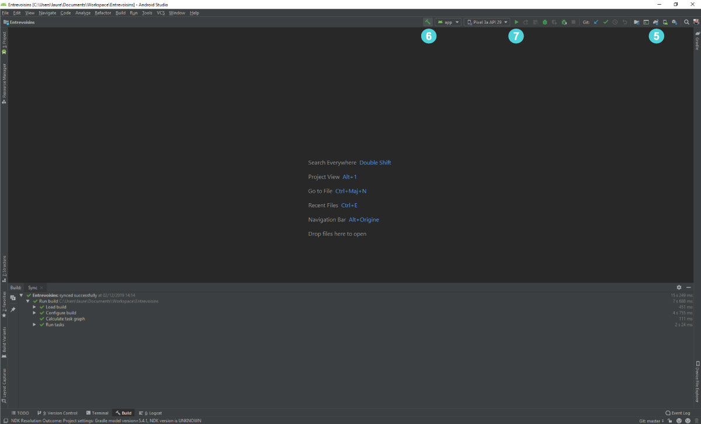
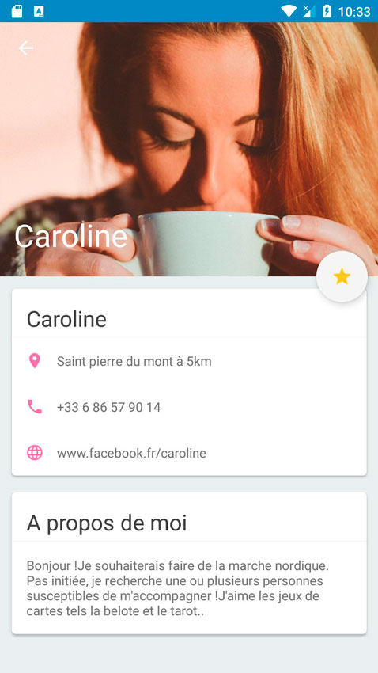

# Entrevoisins

Ce dépôt contient une mini-application pour le P3 du parcours Grande École du Numérique.

## Introduction

Entrevoisins est une application qui  permet à des personnes d’un même quartier de se rendre des petits services : garde d’animaux, petit bricolage, troc d’objets, cours particuliers, de nombreuses options s’offrent aux utilisateurs !

## Configurer le projet dans Android Studio
======================================

### 1. Téléchargez le code du projet, de préférence avec git clone.

### 2. Ouvrer Android Studio et cliquer sur "Check out project from Version Control" et cliquer sur Git.
### 3. Coller l'url du dépôt git dans le champ "URL".
### 4. Modifier le dossier d'installation du dépôt si besoin dans le champ "Directory".

### 5. Synchroniser le projet avec Gradle si besoin en cliquant sur l'icône éléphant.
### 6. Compiler le projet en cliquant sur l'icône marteau.
### 7. Séléctionner un appareil android si besoin et lancer le projet en cliquant sur l'icône flêche verte.

### 8. Profiter du projet et n'hésiter pas à contribuer ou à faire part d'un bug sur le dépot Github du projet.

