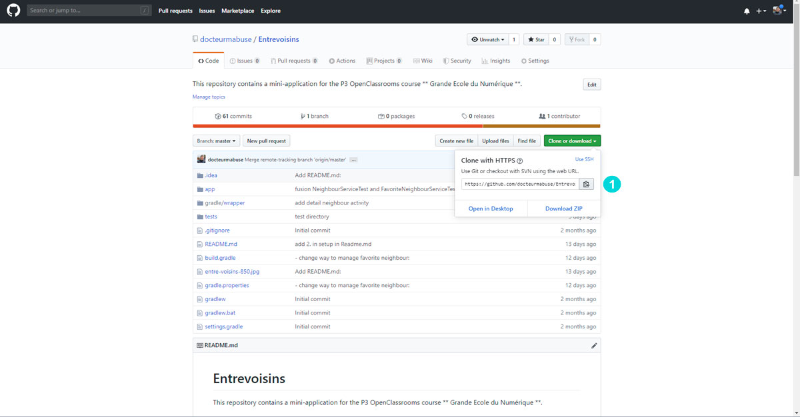
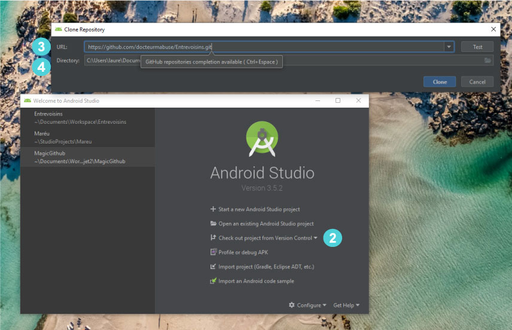
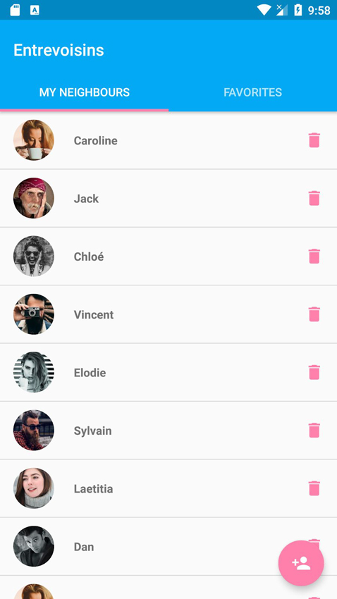
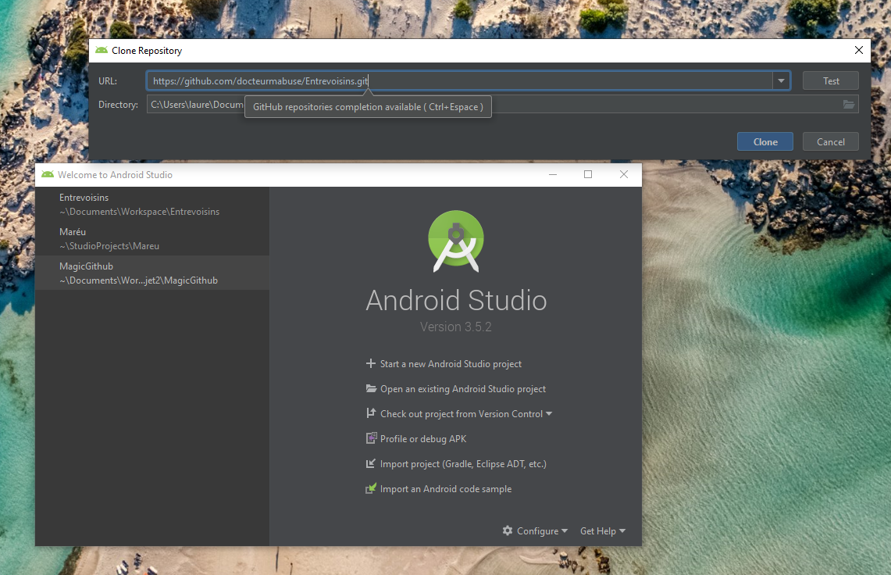
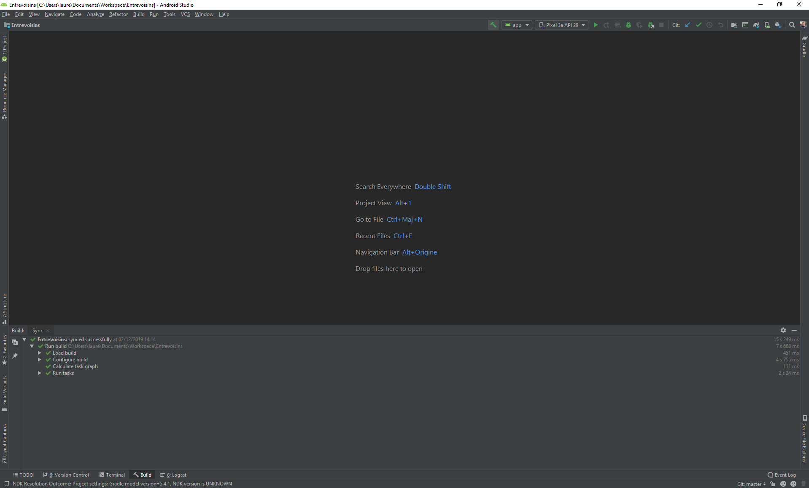
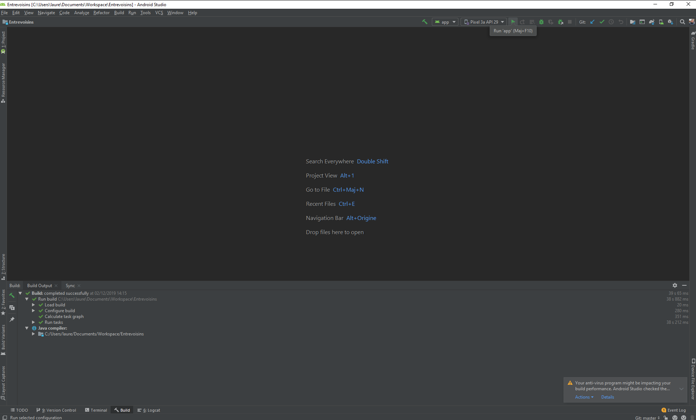
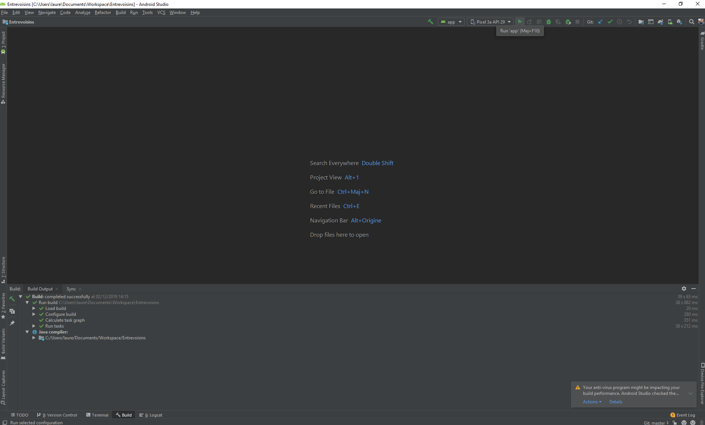

# Entrevoisins

Ce dépôt contient une mini-application pour le P3 du parcours Grande École du Numérique.

## Introduction

Entrevoisins est une application qui  permet à des personnes d’un même quartier de se rendre des petits services : garde d’animaux, petit bricolage, troc d’objets, cours particuliers, de nombreuses options s’offrent aux utilisateurs !

## Configurer le projet dans Android Studio
======================================

### 1. Téléchargez le code du projet, de préférence avec git clone

### 2. Ouvrer Android Studio et cliquer sur "Check our project from Version Control" et cliquer sur Git

2. Click Build and make project
3. Run the app

  
  
  
